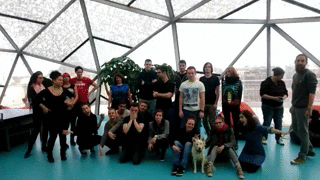

# Happy Code Friends

Happy Code Friends is a program incorporating learnings and inspired by formats like Mozilla WebMaker, OpenTechSchool or NodeSchool and several others to create a free, introductory course to web development for anyone, but with a focus on increasing the field's diversity, mentored by seasoned web developmers and trainers. 

Our goal is to dispell the mystery around web development (and programming in general), show them and guide them as they slowly ease themselves into learning how to be creators, rather just consumers of the Web's content. Our intention is to inspire curiosity and kickstart them on their way on self-learning while we try to provide help and mentoring so as to get them over the initial hurdles.

## First pilot

Currently we are running the first "pilot" version of the program, developing curriculum and testing our methods with a group of 20 people from diverse backgrounds. For details see the flyers for the pilot in [English](hcf-flyer-EN.pdf) or [Hungarian](hcf-flyer-HU.pdf).

## Format

The Happy Code Friends format (currently work-in-progress) includes a weekend (2 days, Sat/Sun) of teaching-mentoring about the basics of web technologies (HTML, CSS, JavaScript), with one month of online mentoring, homework and weekly "mentor sessions" for a month (4 weekends, every Sat) to keep the participants engaged and provide new challenges/guided learning.

All of the workshops and mentoring is completely free, mentors and organizers volunteer their time to give back to the community.

[See the pilot schedule](https://reps.mozilla.org/events/#/period/all/search/happy%20code%20friends/)

### The organizers / mentors

The mentors are professionals working in web development, and some of the organizing team are participants in the pilot themselves. 

### Curriculum

Self-developed curriculum, as well as open-source learning materials.

* [CSSClasses introduction to HTML/CSS](http://cssclasses.cssconf.eu/materials/)
* [Code Invaders - intro to JavaScript via retro games programming](https://thimbleprojects.org/flaki/51988/)

### Tools

Extensive use of online code editors like [Thimble](https://thimble.mozilla.org/), GitHub and browser developer tools. We use Slack and e-mail for communication, and online tools and shared documents for organization.

## Contact

* [happycodefriends](https://github.com/happycodefriends)
* [@happycodefrnds](https://twitter.com/happycodefrnds)
* [email](htmlcsskurzus@gmail.com)
* [slack](https://frontendmeetup.slack.com/messages/happy-code-friends/)

